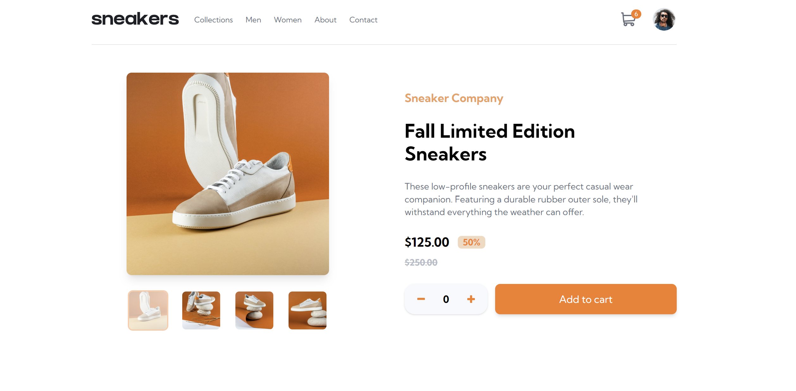

# Frontend Mentor - E-commerce product page solution

This is my solution to the [E-commerce product page challenge on Frontend Mentor](https://www.frontendmentor.io/challenges/ecommerce-product-page-UPsZ9MJp6).

## Table of contents

- [Overview](#overview)
  - [The challenge](#the-challenge)
  - [Screenshot](#screenshot)
  - [Links](#links)
- [My process](#my-process)
  - [Built with](#built-with)
  - [What I learned](#what-i-learned)
- [Author](#author)

## Overview

### The challenge

To fullfil the challenge's requirements, users should be able to:

- View the optimal layout for the site depending on their device's screen size
- See hover states for all interactive elements on the page
- Open a lightbox gallery by clicking on the large product image
- Switch the large product image by clicking on the small thumbnail images
- Add items to the cart
- View the cart and remove items from it

### Screenshot

### Links

- Solution URL: [Add solution URL here](https://your-solution-url.com)
- Live Site URL: [Add live site URL here](https://your-live-site-url.com)

## My process

### Built with

- React
- Tailwind
- Zustand
- Framer-Motion
- Semantic HTML5 markup
- Mobile-first workflow

### What I learned

This project was an amazing opportunity to hone my skills with state management (Zustand), animate the cart and the sidebar menu (Framer-Motion), and styling with Tailwind.

For the state management, I had used Redux store before (see my previous Safeway project), but for such a simple web app with a single product, I opted for the smaller and faster state management solution Zustand. I was pleasantly surprised at how quickly I was able to set up the store and access the data from the cart. It will definitely be my go-to solution in the future for my more simple needs in terms of state management. 

It was also a great opportunity to play with Framer-Motion, a tool I want to delve into more in my future projects. I went for two rather simple animations for the sidebar menu and the cart, with a slight unrolling effect for the latter.

It was also my first time using Tailwind. I personally stand with purists and prefer having separate style sheets, with SASS being my favourite preprocessor. However I wanted to make sure to know enough about Tailwind to build an entire web app with it. I was impressed by the simplicity of its classnames and once I got a hang of it I enjoyed how quickly I was able to style elements. I did find it limiting in some aspect, such as exact positioning for an element with an absolute position as well as using it to colorize elements with customs colors. I also expected it to include aspect-ratio and animations, which it does not. In those cases I went to the CSS-route.

One challenge I encountered was implementing the lightbox, which I wanted to create manually instead of relying on a library. At first I thought of enlarging the selected picture but it clearly affected the carousel's styling. When I then tried to mount another carousel from the carousel itself with a onClick event, it affected the event itself and ended up mounting a new carousel everytime I clicked on the main image.

My solution was to create a separate lightbox, and pass into it the index of the image in focus. To avoid repeating myself I imported the image iteration from a separate file which the carousel used as well. In the future, I'd like to smooth out the styling when it appears on the screen as well as the effect of the image sliding . This time however I think I will rely on an external library or Framer-Motion.

Finally, one element I am proud of is the way the menu disappears if you resize the window or click outside of it. I applied the same logic to the cart and the menu except that for the cart I left it open even if you click elsewhere, as most website do.

One remaining issue is the position of the cart when the screen is in medium-size. I left this issue to start working on a new project but this is something I want to be aware of in the future.

## Author

- Website - [Kangkm](https://github.com/KangFennex)
- Frontend Mentor - [@KangFennex](https://www.frontendmentor.io/profile/KangFennex)
